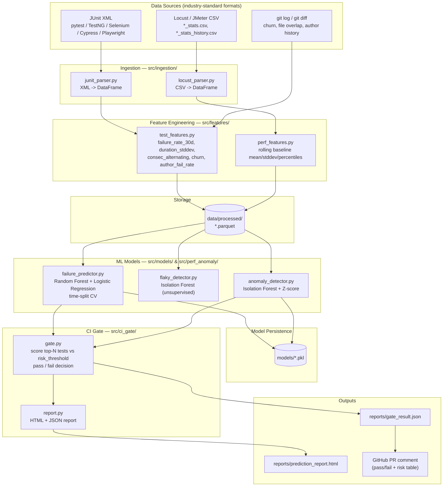
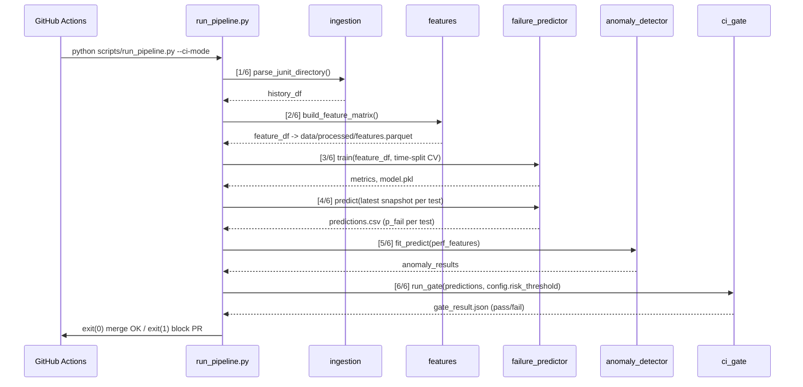
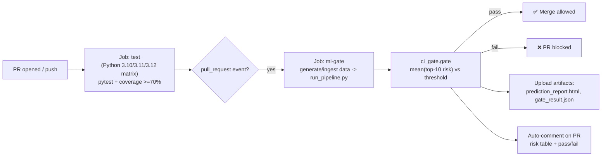

# QA ML Framework — Architecture

A visual walkthrough of how raw test/perf data becomes a merge-blocking risk score. Diagrams render natively on GitHub (Mermaid).

---

## 1. System overview

---

## 2. Pipeline execution order (`scripts/run_pipeline.py`)

---

## 3. CI/CD integration (`.github/workflows/ci.yml`)

---

## 4. Component responsibility map

| Layer | Module | Responsibility | Technique |
|---|---|---|---|
| Ingestion | `src/ingestion/junit_parser.py` | XML → tabular test history | lxml |
| Ingestion | `src/ingestion/locust_parser.py` | Perf CSV → tabular time series | pandas |
| Features | `src/features/test_features.py` | Rolling failure rate, flakiness signals, churn | pandas |
| Features | `src/features/perf_features.py` | Rolling baseline stats | pandas |
| Model | `src/models/failure_predictor.py` | P(test fails on this commit) | Random Forest + Logistic Regression, time-split CV |
| Model | `src/models/flaky_detector.py` | Flag non-deterministic tests | Isolation Forest (unsupervised) |
| Model | `src/perf_anomaly/anomaly_detector.py` | Perf regression detection | Isolation Forest + Z-score |
| Decision | `src/ci_gate/gate.py` | Threshold scoring → pass/fail | rule on top-N mean risk |
| Reporting | `src/ci_gate/report.py` | Human-readable output | HTML/JSON generation |
| Orchestration | `scripts/run_pipeline.py` | Wires all 6 stages end-to-end | — |
| Delivery | `.github/workflows/ci.yml` | Test matrix + risk gate + PR feedback | GitHub Actions |

---

## 5. Design rationale

- **Layered, not monolithic**: ingestion / features / model / decision / reporting are separate modules — each independently testable (`tests/test_ingestion.py`, `test_features.py`, `test_models.py`, `test_perf_anomaly.py`) and swappable (e.g. Locust parser could be replaced by JMeter without touching the model layer).
- **Time-split CV, not k-fold**: test results are time-ordered; k-fold would leak future data into training and produce offline metrics the model can't actually hit once it's scoring runs it hasn't seen yet.
- **Random Forest over XGBoost**: `feature_importances_` gives an interpretable answer to "why was this test flagged," which matters when the gate blocks a PR and someone needs a reason, not just a score.
- **Unsupervised where labels don't exist**: flaky-test detection and perf anomalies have no ground-truth labels, so Isolation Forest is used instead of forcing a supervised approach onto a problem that doesn't have one.
- **The gate is a pure function of config**: `risk_threshold` and `top_n_tests` live in `config.yaml`, not hardcoded — same codebase tunable per team/repo without a code change.
- **CI is the actual product surface**: the ML output isn't a dashboard nobody looks at — it's wired directly into the PR merge decision and posts a comment, so the model's output has to earn its keep at the point where engineers actually work.

## 6. Known limitations (not yet solved)

- **Validated on synthetic data only.** The failure predictor and anomaly detector have never been run against a real project's accumulated CI/perf history — only against `scripts/generate_sample_data.py` output, which has cleaner, hand-injected patterns than real flakiness.
- **No drift monitoring.** Nothing tracks whether a deployed model's accuracy degrades as the test suite and codebase evolve; there's no retraining trigger.
- **Gate averages top-N risk.** `gate.py` compares `mean(top_10_risk_scores)` to the threshold, so one severely at-risk test can be diluted by nine lower-risk ones and still pass. Worth pairing with a hard per-test ceiling.
- **Rolling z-score features self-normalize.** A performance regression that persists longer than `baseline_window` samples gradually gets absorbed into its own rolling baseline and the anomaly score decays back toward zero — a known weakness of any purely rolling reference window.
